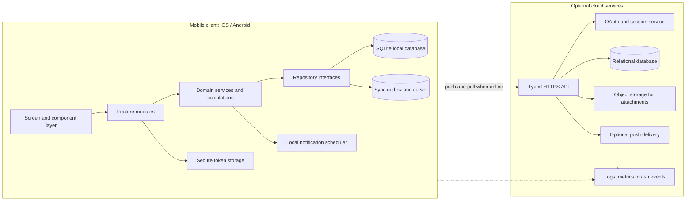
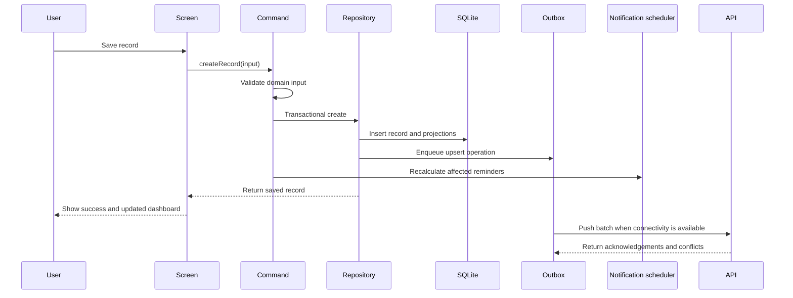

# Technical Architecture Plan

## Vehicle Care Log Mobile Application

**Document status:** Architecture proposal  
**Version:** 1.0  
**Author:** Manus AI  
**Platforms:** iOS and Android  
**Scope:** Architecture and delivery planning only; implementation has not started

> **Architecture objective:** Make the core vehicle-recording experience fast and reliable when offline, while preserving a clean path to optional account-backed synchronization, attachments, and multi-device access.

---

## 1. Architectural Summary

Vehicle Care Log should use a **local-first, cross-platform mobile architecture**. The application should write vehicle records to a device-local database first, render the dashboard from that database, and synchronize changes to a cloud backend only when the user enables an account or backup feature. This keeps the most important workflows—recording fuel, service, repairs, and reminders—available without a network connection.

The recommended client stack is **Expo and React Native with TypeScript**, file-based navigation through Expo Router, NativeWind or equivalent tokenized styling, a domain-oriented feature structure, and a repository layer that isolates storage from the UI. The local source of truth should be SQLite for normalized vehicle records and an outbox for synchronization. Small preferences such as units, currency, and notification settings can remain in key-value storage. Expo’s current guidance explicitly describes SQLite as a suitable persistence layer for local-first applications, while Expo Router provides file-based routing for native and web targets.[1] [2]

The cloud layer should be optional rather than required for first use. When enabled, it should provide authentication, a relational database, typed API procedures, object storage for attachments, and synchronization endpoints. The server should never be required for a user to save a basic record locally. Authentication tokens belong in platform-protected secure storage rather than in ordinary application storage.[3]

### Recommended architecture decision

| Decision area | Recommendation | Rationale |
|---|---|---|
| Mobile framework | Expo + React Native + TypeScript | One codebase for iOS and Android with access to native notifications, storage, permissions, and deep linking. |
| Navigation | Expo Router with tab, stack, and modal route groups | Keeps navigation close to the screen tree and supports notification deep links. |
| Client state | Local database queries for domain data; lightweight context or reducer for session and UI state; TanStack Query for server request state | Prevents dashboard data from being duplicated across multiple global stores. |
| Local persistence | SQLite for vehicles, records, reminders, attachments, and sync metadata; key-value storage for small preferences | Provides transactions, indexes, migrations, and reliable offline reads and writes. |
| Cloud API | Typed tRPC procedures over HTTPS, with server-side Zod validation | Reuses shared TypeScript types and keeps client/server contracts explicit. |
| Cloud database | Relational SQL database managed through Drizzle ORM | Fits the relational domain and supports reports, ownership checks, migrations, and indexes. |
| Authentication | Optional account using the supplied OAuth/session pattern | Device-only use remains available; account use unlocks backup and cross-device access. |
| Notifications | Local scheduled notifications for date-based reminders; optional remote push only when cloud synchronization requires it | Local notifications work offline and avoid introducing a server scheduler for the MVP. Expo Notifications supports one-off and repeating schedules and notification-response handling.[4] |
| Attachments | Defer to the second implementation slice or use object storage with signed upload URLs | Images and receipts introduce lifecycle, quota, privacy, and offline-upload complexity. |
| Conflict policy | Deterministic last-write-wins for single-owner records, with tombstones and audit metadata | Appropriate for an individual owner and simpler than CRDT-based collaboration. |

## 2. Viable Architecture Options

The product can be implemented in two viable ways. The first is the recommended path because it preserves the MVP’s low-friction user experience while leaving room for growth. The second is a lighter alternative for a strictly personal, single-device release.

| Approach | Tradeoffs | Cost | Setup Complexity |
|---|---|---|---|
| **Local-first with optional cloud synchronization — recommended** | Best offline experience and future multi-device support; requires sync protocol, authentication, server database, migrations, and conflict handling. | Higher infrastructure and engineering surface than local-only; exact operating cost depends on selected services and usage. | Medium to high. |
| **Local-only mobile application** | Fastest MVP and simplest privacy model; no account, backup, or multi-device recovery unless export is added. Device loss or app deletion can make records unavailable. | Lowest infrastructure cost because no backend is required. | Low. |

The recommendation is to build the domain and repository interfaces so both modes are supported. The first release can ship with local-only behavior behind a feature flag if cloud infrastructure is not ready, without rewriting the UI or domain calculations later.

## 3. System Context and Boundaries

The system is divided into four boundaries: the mobile client, the optional synchronization API, the relational database, and the attachment/notification services. The mobile client owns immediate interaction, local persistence, validation feedback, dashboard derivation, and local reminder scheduling. The server owns identity, authorization, durable cloud copies, cross-device change exchange, attachment authorization, and server-side audit metadata.



### Boundary rules

The UI must not issue raw SQL, construct sync payloads, or calculate business totals directly. Feature modules call application services or repository methods. Domain services contain pure calculations and validation that can be unit tested without a device. Repositories own SQLite queries, migrations, and mapping between persistence records and domain objects. The sync engine is the only component allowed to read the outbox and apply remote changes.

The server must not trust identifiers supplied by the client. Every protected procedure must derive the current user from the authenticated session, verify ownership of the vehicle and record, validate the payload, and then read or write only permitted rows. Client-generated UUIDs are accepted for idempotency but are not treated as authorization claims.

## 4. Mobile Application Architecture

### 4.1 Layer model

The mobile application should follow a layered, feature-oriented structure rather than a screen-oriented collection of unrelated files.

| Layer | Responsibility | Must not do |
|---|---|---|
| Presentation | Render screens, cards, forms, loading states, empty states, errors, and accessibility labels. | Execute SQL, make authorization decisions, or duplicate business calculations. |
| Feature/application | Orchestrate user actions such as “save fuel entry” or “complete reminder”; coordinate repositories, notifications, and cache invalidation. | Own platform-specific storage details. |
| Domain | Define entities, value objects, validation rules, expense derivation, fuel-efficiency calculations, due-state calculations, and sync-merge rules. | Import React Native UI modules or assume network availability. |
| Data/repository | Expose typed interfaces for vehicles, records, reminders, expenses, attachments, and sync. | Leak SQLite rows or server response shapes into screens. |
| Infrastructure | Implement SQLite, secure storage, network transport, file handling, notifications, connectivity, and logging adapters. | Contain product-specific UI logic. |

### 4.2 Proposed project structure

```text
app/
  _layout.tsx
  (tabs)/
    _layout.tsx
    index.tsx                 # Dashboard
    service.tsx               # Service and reminders
    expenses.tsx              # Expense summary
    settings.tsx              # More / settings
  vehicle/
    index.tsx                 # Vehicle list
    new.tsx
    [id].tsx
  records/
    new.tsx                   # Entry type selection
    fuel.tsx
    service.tsx
    repair.tsx
    [id].tsx
  reminders/
    new.tsx
    [id].tsx
  modal/
    vehicle-selector.tsx
    filter.tsx

components/
  cards/
  forms/
  lists/
  charts/
  feedback/
  screen-container.tsx
  ui/

features/
  dashboard/
  vehicles/
  fuel/
  service/
  repairs/
  reminders/
  expenses/
  attachments/
  settings/

src/
  domain/
    entities/
    value-objects/
    calculations/
    validation/
    sync/
  application/
    commands/
    queries/
    selectors/
  data/
    repositories/
    mappers/
    local/
    remote/
  infrastructure/
    db/
    auth/
    notifications/
    files/
    connectivity/
    telemetry/
  state/
  theme/

shared/
  schemas.ts
  types.ts
  constants.ts

server/
  db.ts
  routers.ts
  storage.ts
  sync.ts
  jobs.ts

drizzle/
  schema.ts
  relations.ts
  migrations/

tests/
  domain/
  repositories/
  sync/
  e2e/
```

The project scaffold should retain framework-owned files and conventions. All screens should use a safe-area-aware container, long data sets should use virtualized lists, and tab icons should be registered in the project’s icon mapping before being referenced by the tab layout. These conventions reduce platform-specific layout defects and avoid common interaction failures.[5]

### 4.3 Navigation architecture

The app should use a root stack containing the primary tab group and modal or detail routes. The four primary tabs are Dashboard, Service & Reminders, Expenses, and More/Settings. Add flows should be presented as stack screens or sheets, depending on platform conventions, so that users can cancel without losing the current tab state.

| Route | Purpose | Entry points |
|---|---|---|
| `/(tabs)/` | Dashboard for active vehicle | App launch, vehicle selection, notification completion. |
| `/(tabs)/service` | Service history and reminders | Tab, dashboard service card, reminder notification. |
| `/(tabs)/expenses` | Expense reports and source entries | Tab, dashboard summary, category card. |
| `/(tabs)/settings` | Preferences, vehicles, data, account | Tab, profile or setup flow. |
| `/vehicle/[id]` | Vehicle detail and profile management | Vehicle selector, settings, dashboard header. |
| `/records/new` | Select entry type | Quick action menu. |
| `/records/fuel` | Fuel form | Dashboard Fuel action, fuel history. |
| `/records/service` | Service form | Dashboard Service action, reminder completion. |
| `/records/repair` | Repair form | Dashboard Repair action. |
| `/records/[id]` | View or edit a saved record | Any history list or expense source. |
| `/reminders/new` | Create a reminder | Dashboard or service area. |
| `/reminders/[id]` | View, complete, snooze, or reschedule | Service list or notification deep link. |

Notification payloads should contain a stable deep-link path such as `/reminders/{id}`. The root layout should handle both cold-start and foreground notification responses so a user reaches the same detail screen regardless of app state.[4]

## 5. Domain Model and Business Rules

### 5.1 Domain entities

The domain model should use client-generated UUIDs so records can be created offline and later synchronized without waiting for server-generated integer IDs. Dates should be stored as UTC instants or explicit local-date values according to their meaning: event timestamps such as record creation use UTC timestamps, while a user-entered service date should preserve the selected local calendar date.

| Entity | Key fields | Business role |
|---|---|---|
| Vehicle | `id`, `ownerId`, `make`, `model`, `year`, `fuelType`, `odometer`, `archivedAt` | Root aggregate for all vehicle-specific records. |
| FuelEntry | `id`, `vehicleId`, `eventDate`, `odometer`, `quantity`, `amount`, `unitPrice`, `fuelType`, `station`, `notes` | Records a refueling event and contributes to fuel metrics and expenses. |
| ServiceRecord | `id`, `vehicleId`, `eventDate`, `odometer`, `category`, `description`, `provider`, `amount`, `notes` | Records scheduled or routine maintenance. |
| RepairRecord | `id`, `vehicleId`, `eventDate`, `odometer`, `issue`, `workPerformed`, `provider`, `amount`, `notes` | Records unscheduled repair work. |
| Reminder | `id`, `vehicleId`, `title`, `category`, `dueDate`, `dueOdometer`, `recurrence`, `status` | Tracks future obligations and completion state. |
| Attachment | `id`, `recordId`, `localUri`, `remoteKey`, `mimeType`, `uploadState` | Associates optional receipts or photos with records. |
| Expense | `id`, `vehicleId`, `sourceType`, `sourceId`, `category`, `eventDate`, `amount` | Provides a normalized reporting projection from cost-bearing records. |
| SyncMetadata | `entityId`, `entityType`, `version`, `updatedAt`, `deletedAt`, `syncState` | Supports idempotent synchronization and tombstone retention. |

### 5.2 Expense projection

Fuel, service, and repair records should remain the authoritative source for their own details. The expense report should read from a normalized expense projection or SQL view rather than requiring the user to enter the same amount twice. A future standalone expense feature can add an `Expense` source type without changing the existing record tables.

The projection should include the source record ID so the user can open the original entry from a chart, category, or list row. When a source record is edited or deleted, the projection must be recalculated or updated in the same local transaction.

### 5.3 Reminder state machine

Reminder state should be derived from stored status, due date, due odometer, and the active vehicle’s latest odometer. The state machine should include `upcoming`, `dueSoon`, `overdue`, `completed`, `snoozed`, and `archived`. A reminder with both date and mileage triggers should be considered due when either trigger is reached unless the product explicitly changes this rule.

A reminder completion may optionally create a service or repair record. The completion command should be idempotent so tapping the notification twice cannot create duplicate completion records.

### 5.4 Validation rules

Validation must exist in both the domain layer and the server boundary. The client validation provides immediate feedback; the server validation protects cloud data and rejects malformed or unauthorized payloads.

| Rule | Behavior |
|---|---|
| Vehicle make and model | Required for a normal profile; trimmed and length-limited. |
| Odometer | Non-negative; cannot silently decrease unless the user explicitly confirms a correction. |
| Monetary amount | Non-negative; stored as an integer minor-unit value or a decimal-safe representation, never as an imprecise binary display value. |
| Fuel quantity | Positive when supplied; unit is stored with the user’s measurement preference. |
| Reminder trigger | At least one of due date or due odometer must be present. |
| Record ownership | Every record must reference an existing vehicle owned by the current user in cloud mode. |
| Dates | Event dates cannot be silently shifted by timezone conversion. |
| Attachments | MIME type, size, local accessibility, and upload status must be validated before enqueueing. |

## 6. Local Persistence Architecture

### 6.1 SQLite as the local source of truth

The SQLite database should be the source of truth for user-visible domain data on the device. It should be opened through a single database provider, use versioned migrations, and expose repository methods rather than allowing screens to issue ad hoc queries. SQLite supports transactions and indexes suitable for the record, reminder, and expense workloads; Expo’s local-first guide presents it as a persistence choice that can sit beneath state and synchronization layers.[2]

Key-value storage should be reserved for small, non-relational values such as `activeVehicleId`, selected currency, distance unit, fuel unit, onboarding completion, and notification preferences. Authentication tokens must be stored separately in secure storage, not in SQLite or ordinary key-value storage.[3]

### 6.2 Proposed local tables

```text
vehicles
  id TEXT PRIMARY KEY
  make TEXT NOT NULL
  model TEXT NOT NULL
  year INTEGER
  fuel_type TEXT NOT NULL
  odometer REAL NOT NULL DEFAULT 0
  image_local_uri TEXT
  archived_at TEXT
  created_at TEXT NOT NULL
  updated_at TEXT NOT NULL
  sync_version INTEGER
  sync_state TEXT NOT NULL

fuel_entries
  id TEXT PRIMARY KEY
  vehicle_id TEXT NOT NULL REFERENCES vehicles(id)
  event_date TEXT NOT NULL
  odometer REAL NOT NULL
  quantity REAL
  amount_minor INTEGER
  currency TEXT
  unit_price_minor INTEGER
  fuel_type TEXT
  station TEXT
  notes TEXT
  created_at TEXT NOT NULL
  updated_at TEXT NOT NULL
  deleted_at TEXT
  sync_state TEXT NOT NULL

service_records
  id TEXT PRIMARY KEY
  vehicle_id TEXT NOT NULL REFERENCES vehicles(id)
  event_date TEXT NOT NULL
  odometer REAL NOT NULL
  category TEXT NOT NULL
  description TEXT NOT NULL
  provider TEXT
  amount_minor INTEGER
  currency TEXT
  notes TEXT
  created_at TEXT NOT NULL
  updated_at TEXT NOT NULL
  deleted_at TEXT
  sync_state TEXT NOT NULL

repair_records
  id TEXT PRIMARY KEY
  vehicle_id TEXT NOT NULL REFERENCES vehicles(id)
  event_date TEXT NOT NULL
  odometer REAL NOT NULL
  issue TEXT NOT NULL
  work_performed TEXT
  provider TEXT
  amount_minor INTEGER
  currency TEXT
  notes TEXT
  created_at TEXT NOT NULL
  updated_at TEXT NOT NULL
  deleted_at TEXT
  sync_state TEXT NOT NULL

reminders
  id TEXT PRIMARY KEY
  vehicle_id TEXT NOT NULL REFERENCES vehicles(id)
  title TEXT NOT NULL
  category TEXT NOT NULL
  due_date TEXT
  due_odometer REAL
  recurrence_json TEXT
  status TEXT NOT NULL
  last_completed_at TEXT
  created_at TEXT NOT NULL
  updated_at TEXT NOT NULL
  deleted_at TEXT
  sync_state TEXT NOT NULL

attachments
  id TEXT PRIMARY KEY
  record_type TEXT NOT NULL
  record_id TEXT NOT NULL
  local_uri TEXT
  remote_key TEXT
  mime_type TEXT NOT NULL
  byte_size INTEGER
  upload_state TEXT NOT NULL
  created_at TEXT NOT NULL
  updated_at TEXT NOT NULL
  deleted_at TEXT

sync_outbox
  id TEXT PRIMARY KEY
  entity_type TEXT NOT NULL
  entity_id TEXT NOT NULL
  operation TEXT NOT NULL
  payload_json TEXT NOT NULL
  client_updated_at TEXT NOT NULL
  attempts INTEGER NOT NULL DEFAULT 0
  last_error TEXT
  created_at TEXT NOT NULL

sync_state
  key TEXT PRIMARY KEY
  value TEXT NOT NULL
```

### 6.3 Transaction boundaries

Each user mutation should be a single local transaction. For example, saving a fuel entry should insert the fuel row, update the vehicle’s last known odometer if the new value is greater, create or update the expense projection, and enqueue one outbox operation. If any part fails, none of the changes should be visible.

Editing or deleting a source record must update dependent projections in the same transaction. Deletions should be soft deletes locally and on the server until the record is safely synchronized and outside the retention window required for conflict resolution.

### 6.4 Query and indexing strategy

The database should index `vehicle_id`, `event_date`, `updated_at`, `deleted_at`, and reminder status. The dashboard should use bounded queries: latest fuel entry, nearest active reminder, most recent records, current-period expenses, and current odometer. History screens should paginate or use virtualized lists. A large history should never be loaded into a single in-memory array merely to render the first screen.

## 7. Repository and Data Flow

The repository interfaces should be stable whether the app is local-only or cloud-enabled. A representative interface is:

```ts
interface VehicleRepository {
  listActive(): Promise<Vehicle[]>;
  getById(id: string): Promise<Vehicle | null>;
  create(input: CreateVehicleInput): Promise<Vehicle>;
  update(id: string, input: UpdateVehicleInput): Promise<Vehicle>;
  archive(id: string): Promise<void>;
}

interface RecordRepository {
  listRecent(vehicleId: string, limit: number): Promise<VehicleRecord[]>;
  getById(id: string): Promise<VehicleRecord | null>;
  create(input: CreateRecordInput): Promise<VehicleRecord>;
  update(id: string, input: UpdateRecordInput): Promise<VehicleRecord>;
  remove(id: string): Promise<void>;
}

interface ReminderRepository {
  listOpen(vehicleId: string): Promise<Reminder[]>;
  create(input: CreateReminderInput): Promise<Reminder>;
  complete(id: string, input: CompleteReminderInput): Promise<void>;
  snooze(id: string, input: SnoozeReminderInput): Promise<void>;
}
```

The application command layer should implement operations such as `createFuelEntry`, `createServiceRecord`, `completeReminder`, `switchActiveVehicle`, and `syncNow`. Screens call commands and subscribe to repository-backed selectors. This keeps the UI independent from whether data was loaded locally or pulled from the server.

## 8. Offline and Synchronization Architecture

### 8.1 Offline-first write path

The write path is deliberately local and synchronous from the user’s perspective:



The user should never wait for the server to confirm a normal record save. The UI should show a compact sync status such as **Saved on this device**, **Syncing**, **Synced**, or **Sync needs attention**. These labels should not block access to the record.

### 8.2 Sync protocol

The synchronization protocol should use stable UUIDs, an outbox, idempotent operations, soft-delete tombstones, and a server cursor.

| Operation | Client behavior | Server behavior |
|---|---|---|
| Push | Send a bounded batch of create, update, and delete operations with entity ID, client timestamp, and payload. | Validate ownership and schema, apply idempotently, return accepted version or conflict. |
| Pull | Request changes after the last cursor, scoped to the authenticated user. | Return ordered changes and a new cursor, including tombstones until retention expires. |
| Bootstrap | Upload or download a complete local snapshot when linking a device for the first time. | Require explicit user choice when local and cloud data both exist. |
| Retry | Exponential backoff with a maximum attempt count and visible error state. | Return typed errors distinguishing validation, authorization, conflict, and transient failure. |
| Delete | Write a tombstone locally and enqueue delete. | Preserve tombstone long enough for other devices to observe deletion. |

A sync cycle should push local changes before pulling remote changes, then run a second lightweight push if any local conflict resolution produces a new local mutation. Batches should be small enough to avoid long request times and should resume after interruption.

### 8.3 Conflict resolution

The MVP is a single-owner product rather than a collaborative editor. The recommended conflict policy is last-write-wins based on a server-issued version or monotonic update timestamp, with the following safeguards:

1. The server rejects updates to records the user does not own.
2. A stale client version receives the current server version and conflict metadata.
3. The client preserves the rejected local payload in a recoverable conflict log rather than silently discarding it.
4. Deletes are represented by tombstones, so an older client cannot resurrect a record accidentally.
5. The UI may expose a “Review sync issue” screen in a later slice; MVP can resolve non-critical single-user conflicts automatically and log them for diagnostics.

CRDTs or real-time collaborative editing are not justified by the current product scope. They would increase implementation and testing complexity without improving the primary use case.

### 8.4 Device-only and account-linked modes

The app should support the following modes:

| Mode | Data location | User experience |
|---|---|---|
| Device-only | Local SQLite only | Full core functionality, no sign-in, no cross-device sync. |
| Account linked | Local SQLite plus cloud database | Same local-first behavior with background backup and sync. |
| New device | Cloud snapshot restored into local SQLite | User signs in, chooses a vehicle/data set, then works locally. |

When a device-only user creates an account, the app must not overwrite local data automatically. It should present a clear merge choice: upload local data, download cloud data, or keep local data and decide later.

## 9. Cloud Backend Architecture

### 9.1 Server modules

The optional backend should be organized around business boundaries rather than a single large router file.

```text
server/
  routers.ts                 # Root composition only
  routers/
    auth.ts
    vehicles.ts
    records.ts
    reminders.ts
    expenses.ts
    sync.ts
    attachments.ts
  db.ts                      # Query helpers and transactions
  repositories/
  sync.ts                    # Push, pull, cursor, conflict logic
  storage.ts                 # Signed upload/download helpers
  notification-service.ts    # Optional remote push adapter
  validation.ts
  observability.ts
```

The API should expose typed procedures such as `vehicles.list`, `vehicles.create`, `records.listRecent`, `reminders.listOpen`, `expenses.summary`, `sync.pushBatch`, `sync.pullChanges`, and `attachments.createUploadIntent`. The normal CRUD procedures are useful for initial bootstrap and administrative flows; the sync procedures are the durable path for incremental changes.

### 9.2 Server database

The cloud database should mirror the domain entities with server-owned `user_id`, `created_at`, `updated_at`, `deleted_at`, and `version` fields. Every table containing user data must have an ownership index. Foreign-key constraints should prevent orphaned records, while application code should enforce that the referenced vehicle belongs to the authenticated user.

The server should calculate authoritative summary values only when required for cross-device or export flows. The mobile dashboard should continue to derive its display from local data to remain available offline. Server and client calculations must share explicit rounding and unit rules to avoid confusing differences.

### 9.3 Attachments

Attachments should be optional and isolated from the record transaction. The client first saves the record and a pending attachment row locally, requests a signed upload intent when online, uploads directly to object storage, then marks the attachment as uploaded after server confirmation. The server should validate ownership before issuing upload or download access.

The app should create resized image derivatives for previews, retain the original only when needed, and enforce file-type and size limits. Offline attachments remain in an upload queue and should show a clear pending state. Deleting a record should enqueue attachment deletion after the record tombstone is safely synchronized.

## 10. Reminder and Notification Architecture

### 10.1 MVP strategy: local notifications

Date-based reminders should be scheduled locally on each device. Local scheduling is the correct default because it works without a server, avoids server-side time-zone mistakes, and supports a device-only mode. Expo Notifications supports scheduling, presenting, receiving, and responding to notifications on iOS and Android.[4]

The notification scheduler should be an infrastructure adapter called by domain commands. It should not be called directly from screen components.

```text
Reminder saved or edited
  -> calculate next occurrence
  -> cancel prior notification by deterministic notification key
  -> schedule new local notification
  -> persist notification key and scheduled occurrence

Vehicle odometer updated
  -> recalculate mileage-triggered reminders
  -> reschedule affected notifications

Reminder completed or archived
  -> cancel pending notification
  -> persist completion state
```

The deterministic notification key should include reminder ID and occurrence number. This prevents duplicate notifications after repeated sync, app restart, or form resubmission. Calendar date calculations must respect the user’s local timezone and daylight-saving changes.

### 10.2 Optional remote push

Remote push should be added only when the product requires a server to notify multiple devices, deliver sync-status alerts, or support future shared accounts. It should not duplicate every local reminder. If remote push is enabled, the server sends only events that are not already scheduled locally, and the client de-duplicates by reminder ID and occurrence key.

Notification payloads should contain a deep link and minimal display information. The app must handle permission denial gracefully and continue to show in-app due states on the dashboard and service screen.

## 11. Security and Privacy Architecture

### 11.1 Authentication and tokens

Device-only mode requires no account. Account mode should use the supported OAuth flow, with the native bearer/session token stored in platform-protected secure storage. SecureStore provides encrypted local key-value storage backed by Android Keystore/SharedPreferences and iOS Keychain services; it is appropriate for tokens and small secrets, not as the source of truth for irreplaceable vehicle records.[3]

Tokens should never be written to logs, analytics events, SQLite domain tables, or crash metadata. Session refresh and logout must clear cached server data or revoke local access according to the chosen identity model.

### 11.2 Authorization

Authorization is enforced server-side at every protected procedure. The server should scope every query by authenticated user ID and verify vehicle ownership before reading or writing records. Client-side route guards improve user experience but are not security controls.

### 11.3 Data protection

The app should use HTTPS for all network traffic, platform secure storage for credentials, database access controls for cloud records, signed short-lived URLs for attachments, and least-privilege service credentials. Sensitive data should be excluded from analytics by default.

The app should provide a clear data deletion flow. Cloud deletion should remove user-owned records, attachments, device tokens, and queued jobs according to the retention policy. Local deletion should remove SQLite records, pending outbox data, attachment caches, and non-token secure values. The product must explicitly explain any platform keychain behavior that may persist after uninstall and reinstall.[3]

### 11.4 Privacy model

The product should collect only what is needed to manage vehicle records, reminders, optional synchronization, and reliability. The privacy policy should explain what is stored locally, what is uploaded when an account is enabled, how attachments are handled, and how users can export or delete data.

## 12. Observability and Operational Readiness

Observability should be designed around user-impacting events rather than verbose payload logging. The client should capture app version, platform, screen or feature area, operation name, and coarse error class. It should not capture free-text notes, receipt images, tokens, VINs, registration identifiers, or full API payloads by default.

| Signal | Examples | Purpose |
|---|---|---|
| Crash reports | Fatal exceptions, native crashes, startup failures | Detect release-blocking stability issues. |
| Client metrics | Dashboard load duration, save duration, local DB errors, sync queue size | Identify slow or unreliable user flows. |
| Server metrics | API latency, error rate, validation rejects, sync batch size, database query time | Protect backend reliability and capacity. |
| Structured logs | Request ID, user-safe entity type, operation, status, duration | Trace failures without logging private content. |
| Product events | Record saved, reminder completed, expense opened, sync enabled | Measure activation and feature value with privacy constraints. |

The sync system should expose a user-safe status screen showing the last successful sync time, pending item count, and whether action is required. Operational dashboards should alert on high sync failure rates, repeated migration failures, attachment upload backlogs, and notification registration errors.

## 13. Testing Architecture

Testing should treat the local database and sync engine as first-class components rather than testing only screens.

| Test layer | Scope | Representative cases |
|---|---|---|
| Domain unit tests | Pure calculations and state transitions | Fuel efficiency, monthly totals, reminder due states, recurrence, currency rounding, odometer corrections. |
| Schema and migration tests | SQLite schema evolution | Fresh install, each migration path, rollback or recovery behavior, index presence. |
| Repository integration tests | Local transactions and projections | Save/edit/delete record, expense recalculation, outbox creation, atomic failure. |
| Sync contract tests | Client/server protocol | Idempotent retry, cursor advancement, tombstones, stale versions, authorization rejection. |
| API integration tests | Protected procedures and database queries | Cross-user access attempts, validation, ownership, attachment authorization. |
| Component tests | Forms, cards, lists, empty/error states | Validation messages, accessible labels, loading states, save feedback. |
| End-to-end tests | Critical user journeys on device or simulator | First setup, add fuel, add service, create reminder, complete reminder, switch vehicles, offline save and later sync. |
| Release smoke tests | Staging and production builds | Login, local persistence, notifications, deep links, database migration, app update. |

The minimum end-to-end suite should cover the journeys in the PRD and must run against a clean database and a seeded multi-vehicle dataset. Offline tests should explicitly disable connectivity, save records, restart the app, restore connectivity, and verify that the server receives exactly one copy of each operation.

## 14. Deployment and Environment Plan

### 14.1 Environments

The project should have development, staging, and production environments. Each environment must have separate database credentials, OAuth configuration, object-storage namespace, notification credentials, and telemetry destination. Production data must never be used in local development or automated tests.

### 14.2 CI/CD pipeline

A pull request should run formatting, linting, TypeScript checks, unit tests, repository tests, sync contract tests, and a migration consistency check. A merge to the main branch should produce a preview or staging build. Production releases should require an approved version, successful smoke tests, and a migration review.

The mobile delivery pipeline should produce signed iOS and Android builds through the selected Expo build service or equivalent native build environment. Store submission should be separated from the build step so a tested binary can be promoted without rebuilding source changes.

### 14.3 Database migrations

Schema changes should be additive where possible. Every migration must be reviewed, generated from the schema definition, applied to staging, tested against representative data, and then applied to production using a controlled release step. The app should remain compatible with the previous server schema during a rolling deployment when possible.

### 14.4 Backups and recovery

Cloud database backups should be enabled before account-backed synchronization launches. The team should define recovery objectives, test restoration, and document how attachment metadata and object-storage files are restored together. Local-only users should be offered an export path before any destructive reset or device migration flow.

## 15. Performance and Scalability Plan

The expected workload is primarily personal records per user, so the architecture should optimize for correctness, fast local interaction, and simple queries rather than premature distributed scaling. The client should use indexed local queries, list virtualization, memoized derived summaries, and bounded dashboard reads.

The server should paginate history, constrain report date ranges, index ownership and vehicle foreign keys, and avoid returning attachments inline with record lists. Expense summaries should aggregate only the selected date range and vehicle scope. If usage grows substantially, report aggregation can move to precomputed summaries without changing the mobile repository contract.

## 16. Accessibility and Design-System Architecture

The design system should define semantic tokens for background, surface, primary action, text, muted text, border, success, warning, and error. Components should consume tokens rather than hard-coded colors so light and dark themes can be supported consistently.

Every status shown with color must also have a label. Icons require accessible labels when they are actionable. Forms must expose validation errors to screen readers, support larger text, and maintain a logical focus order. Touch targets should be tested on both compact and large devices. Charts must have a textual summary and should not be the only way to understand expenses.

The visual reference should guide the composition—light background, strong typography, blue primary actions, compact cards, and dashboard-first hierarchy—but the architecture should keep visual components separate from domain logic so the design can evolve without changing persistence or sync code.

## 17. Implementation Sequence

The following sequence minimizes rework and validates the highest-risk decisions early.

| Phase | Deliverables | Exit criteria |
|---|---|---|
| 1. Foundation | Expo project configuration, theme tokens, route shell, database provider, migration runner, domain types, test harness | App launches on iOS and Android targets; a migration creates a clean local database. |
| 2. Local vehicle and record flows | Vehicle profile, vehicle switching, fuel, service, repair, repositories, local transactions | All core records can be created, edited, deleted, and reopened offline. |
| 3. Dashboard and reporting | Dashboard selectors, recent records, fuel summary, expense projection, monthly filters | Dashboard values match source records after every mutation. |
| 4. Reminders | Reminder state machine, local scheduling adapter, permission flow, deep links | Upcoming, due, overdue, completion, snooze, and notification response flows pass device tests. |
| 5. Optional account and sync | OAuth/session, server schema, protected API, outbox, pull cursor, conflict logging | Two devices can converge on the same user-owned data without duplicate records. |
| 6. Attachments and export | Upload queue, object storage, receipt/photo preview, export format | Attachments recover correctly after offline-to-online transition and deletion. |
| 7. Hardening and release | Accessibility, performance, crash handling, migration rehearsal, store builds, privacy review | Pilot build passes release smoke tests and operational readiness review. |

The project should not start with cloud synchronization before the local domain model and transaction boundaries are stable. Sync magnifies data-model mistakes, so the local-only slice should be exercised with realistic edits, deletes, reminder completion, and multi-vehicle history first.

## 18. Architecture Decision Records to Create

The team should record the following decisions in short Architecture Decision Records before implementation reaches the corresponding phase:

| ADR | Decision |
|---|---|
| ADR-001 | Local-first SQLite versus local-only key-value storage. |
| ADR-002 | Optional account mode and the merge flow when linking an existing local device. |
| ADR-003 | Client-generated UUIDs and sync versioning. |
| ADR-004 | Last-write-wins conflict policy and tombstone retention. |
| ADR-005 | Local notifications for MVP and conditions for adding remote push. |
| ADR-006 | Attachment storage, quotas, signed URLs, and offline upload behavior. |
| ADR-007 | Monetary representation and currency/locale formatting. |
| ADR-008 | Supported iOS/Android versions and release channel strategy. |
| ADR-009 | Analytics and crash-reporting privacy boundaries. |

## 19. Risks Requiring Early Validation

The largest technical risks are not the dashboard UI; they are data integrity, reminder behavior, and synchronization edge cases. The team should prototype local transactions and reminder rescheduling before polishing the visual layer. It should also validate the device-only-to-account merge flow with deliberately conflicting vehicle and record data.

A second risk is overbuilding cloud synchronization before users prove they need it. The repository abstraction and stable IDs create a safe path to add sync later, so the team should keep the first functional slice local-first and treat cloud sync as a separate milestone unless backup is a launch requirement.

A third risk is exposing personal vehicle information in logs, notifications, or attachments. Privacy review should occur before telemetry, notification copy, and object-storage access are finalized.

## 20. Definition of Architectural Readiness

The architecture is ready for implementation when the team has approved the local-first versus local-only rollout decision, selected the database and migration approach, agreed on entity ownership and identifiers, documented the sync protocol, defined reminder scheduling behavior, confirmed account and merge flows, and accepted the security and privacy boundaries.

The implementation team should also have a route map, domain interface list, initial schema, API contract outline, test matrix, environment matrix, and deployment checklist. No screen should be considered complete until its local persistence, error state, empty state, offline state, accessibility behavior, and analytics/privacy behavior are defined.

## 21. References

[1]: https://docs.expo.dev/versions/latest/sdk/router/ "Expo Router documentation"

[2]: https://docs.expo.dev/guides/local-first/ "Expo: Local-first architecture with Expo"

[3]: https://docs.expo.dev/versions/latest/sdk/securestore/ "Expo SecureStore documentation"

[4]: https://docs.expo.dev/versions/latest/sdk/notifications/ "Expo Notifications documentation"

[5]: https://docs.expo.dev/versions/latest/ "Expo SDK documentation"

---

**End of document**
